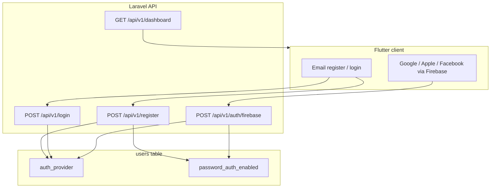

# Auth providers and password capability

Mobile clients need to know **which sign-in method** a user has and **whether in-app password changes are allowed**. This is separate from Sanctum session tokens: the API persists two fields on `users` and returns them on every auth and dashboard response.

Canonical HTTP contract: [api/authentication.md](./api/authentication.md).

---

## Two fields, two concerns

| Column | API field | Purpose |
| --- | --- | --- |
| `auth_provider` | `user.auth_provider` | Identity provider for **Account security messaging** when password change is unavailable (`email`, `google`, `apple`, `facebook`). |
| `password_auth_enabled` | `user.password_auth_enabled` | Whether the Flutter app should show **Change password** (`true` / `false`). Independent of the last sign-in method. |

**Design intent:** A user who registered with email/password and later signs in with Google **keeps** `password_auth_enabled = true` and can still change their password in the app. The social sign-in banner only appears for **social-only** accounts (`password_auth_enabled = false`).

### Account screen behavior (Flutter)

| User type | `password_auth_enabled` | `auth_provider` | UI |
| --- | --- | --- | --- |
| Email/password only | `true` | `email` | Change password |
| Google-only | `false` | `google` | “You signed in with Google…” |
| Email + linked Google | `true` | `email` | Change password (no social banner) |
| Apple-only (future) | `false` | `apple` | “You signed in with Apple…” |
| Facebook-only (future) | `false` | `facebook` | “You signed in with Facebook…” |

---

## Sign-in flows



### Email / password

- **Register** ([`RegisterController`](../app/Http/Controllers/Api/Auth/RegisterController.php)): sets `auth_provider = email`, `password_auth_enabled = true`.
- **Login** ([`LoginController`](../app/Http/Controllers/Api/Auth/LoginController.php)): does not change `auth_provider` or `password_auth_enabled`.

### Social (Firebase)

All social sign-in uses a **single endpoint**:

- **`POST /api/v1/auth/firebase`** — [`FirebaseAuthController`](../app/Http/Controllers/Api/Auth/FirebaseAuthController.php)
- **`POST /api/v1/auth/google`** — deprecated alias to the same controller (kept for older app builds)

The client sends a **Firebase Auth ID token** (`id_token`). The backend:

1. Verifies the JWT via [`FirebaseIdTokenVerifier`](../app/Services/FirebaseIdTokenVerifier.php).
2. Reads `firebase.sign_in_provider` from the token claims (server-trusted; not client-spoofable).
3. Maps the provider to `auth_provider` using [`AuthProvider`](../app/Enums/AuthProvider.php).
4. Resolves or creates the user, then issues a Sanctum token.

#### Firebase `sign_in_provider` → `auth_provider`

| Firebase `sign_in_provider` | `auth_provider` |
| --- | --- |
| `google.com` | `google` |
| `apple.com` | `apple` |
| `facebook.com` | `facebook` |

Unsupported providers return **422** with a validation-style error message.

---

## Account linking rules

Linking logic lives in [`FirebaseAccountLinker`](../app/Services/FirebaseAccountLinker.php).

### New user (no matching `firebase_uid` or email)

Create with:

- `firebase_uid` = token `sub`
- `password_auth_enabled` = `false`
- `auth_provider` = detected provider

A random password is stored (required by the schema) but is not exposed to the client.

### Existing user found by email

Apply [`updatesForSocialSignIn()`](../app/Services/FirebaseAccountLinker.php):

- Always set `firebase_uid`.
- Update `auth_provider` to the social provider **only if** `password_auth_enabled` is already `false` (social-only account).
- **Do not** set `password_auth_enabled = false` when the user already has email/password.

### Existing user found by `firebase_uid`

Same update rules as email match via `updatesForSocialSignIn()`.

---

## API response shape

[`User::toApiArray()`](../app/Models/User.php) includes both fields on register, login, Firebase auth, dashboard, and profile update responses:

```json
{
  "id": 2,
  "name": "Anthony",
  "email": "antharph@gmail.com",
  "password_auth_enabled": false,
  "auth_provider": "google"
}
```

If `auth_provider` is missing on a legacy row, the API defaults to `email` via `authProviderValue()`.

### Password change guard

[`UserPasswordController`](../app/Http/Controllers/Api/UserPasswordController.php) returns **403** when `password_auth_enabled` is `false`, regardless of `auth_provider`.

---

## Database

| Migration | Purpose |
| --- | --- |
| `2026_07_04_000000_add_password_auth_enabled_to_users_table` | Boolean flag for in-app password changes. |
| `2026_07_04_000001_disable_password_auth_for_google_users` | Backfill: users with `firebase_uid` → `password_auth_enabled = false`. |
| `2026_07_04_120000_add_auth_provider_to_users_table` | `auth_provider` string column; backfill email vs google. |

Run migrations inside Docker (see [`.cursor/rules/php-artisan-docker-mcp.mdc`](../.cursor/rules/php-artisan-docker-mcp.mdc)):

```bash
docker exec -i codev_php8.4-webserver-4 php -d display_errors=0 /var/www/expenses/artisan migrate --force
```

---

## Flutter client (reference)

The Flutter app maps `user.auth_provider` to `UserAuthProvider` in session state and drives the Account security section from `password_auth_enabled` + `auth_provider`.

| Layer | Location |
| --- | --- |
| Enum + messages | `expenses_frontend/lib/features/auth/domain/auth_provider.dart` |
| Session parsing | `expenses_frontend/lib/features/auth/application/session_notifier.dart` |
| API client | `expenses_frontend/lib/features/auth/data/auth_api.dart` (`loginWithFirebase`) |
| Account UI | `expenses_frontend/lib/features/account/presentation/account_screen.dart` |

Google sign-in obtains a Firebase ID token, then calls `POST /api/v1/auth/firebase`. Apple and Facebook (when added) should follow the same pattern—no new backend routes required.

---

## Adding Apple or Facebook (Phase 2)

1. Enable the provider in the Firebase console and Flutter (`sign_in_with_apple`, Facebook SDK, etc.).
2. Add `loginWithApple()` / `loginWithFacebook()` in `SessionNotifier` that sign in to Firebase and call `AuthApi.loginWithFirebase(idToken)`.
3. Backend already maps `apple.com` and `facebook.com` from the JWT.

No new Laravel controllers or migrations are needed if the Firebase token includes the standard `firebase.sign_in_provider` claim.

---

## Tests

Unit tests (no full HTTP stack; see [`.cursor/rules/no-database-refresh-in-unit-tests.mdc`](../.cursor/rules/no-database-refresh-in-unit-tests.mdc)):

| Test | Covers |
| --- | --- |
| [`tests/Unit/AuthProviderTest.php`](../tests/Unit/AuthProviderTest.php) | Firebase provider string → enum mapping |
| [`tests/Unit/FirebaseAccountLinkerTest.php`](../tests/Unit/FirebaseAccountLinkerTest.php) | Linking preserves email password capability |
| [`tests/Unit/UserApiArrayTest.php`](../tests/Unit/UserApiArrayTest.php) | `toApiArray()` includes `auth_provider` |

Run in Docker:

```bash
docker exec -i codev_php8.4-webserver-4 php -d display_errors=0 /var/www/expenses/vendor/bin/phpunit -c /var/www/expenses/phpunit.xml --testsuite Unit --filter 'AuthProviderTest|FirebaseAccountLinkerTest|UserApiArrayTest'
```

---

## Key source files

| File | Role |
| --- | --- |
| [`app/Enums/AuthProvider.php`](../app/Enums/AuthProvider.php) | Canonical provider values + Firebase mapping |
| [`app/Http/Controllers/Api/Auth/FirebaseAuthController.php`](../app/Http/Controllers/Api/Auth/FirebaseAuthController.php) | Unified social sign-in |
| [`app/Http/Controllers/Api/Auth/GoogleAuthController.php`](../app/Http/Controllers/Api/Auth/GoogleAuthController.php) | Deprecated alias |
| [`app/Services/FirebaseAccountLinker.php`](../app/Services/FirebaseAccountLinker.php) | Linking without disabling email passwords |
| [`app/Services/FirebaseIdTokenVerifier.php`](../app/Services/FirebaseIdTokenVerifier.php) | JWT verification |
| [`app/Models/User.php`](../app/Models/User.php) | Persistence + `toApiArray()` |
| [`routes/api.php`](../routes/api.php) | `POST /api/v1/auth/firebase`, `POST /api/v1/auth/google` |
